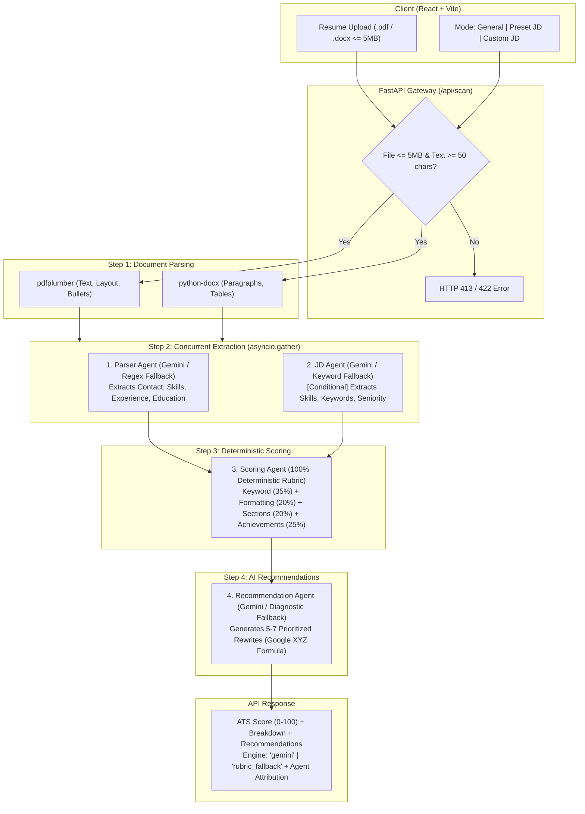

# ResumeFit 🎯

> **AI-Powered & Rubric-Driven ATS Resume Optimizer for University Students**  
> An explainable, multi-agent resume analysis platform that evaluates ATS compatibility, provides deterministic category breakdowns, and generates concrete, metric-driven bullet recommendations.

---

## Table of Contents

- [Overview & What We Built](#overview--what-we-built)
- [Agentic Architecture](#agentic-architecture)
  - [Pipeline Flowchart](#pipeline-flowchart)
  - [Agent Breakdown](#agent-breakdown)
  - [Concurrency & Performance](#concurrency--performance)
  - [Resilience & Retry Loop](#resilience--retry-loop)
- [Scoring Metrics & Mathematical Rubric](#scoring-metrics--mathematical-rubric)
  - [1. Keyword Match (35%)](#1-keyword-match-35-weight)
  - [2. Formatting Hygiene (20%)](#2-formatting-hygiene-20-weight)
  - [3. Section Completeness (20%)](#3-section-completeness-20-weight)
  - [4. Quantified Achievements (25%)](#4-quantified-achievements-25-weight)
- [Engine Attribution Contract](#engine-attribution-contract)
- [Project Structure](#project-structure)
- [Quickstart & Local Setup](#quickstart--local-setup)
  - [Prerequisites](#prerequisites)
  - [Backend Setup](#backend-setup)
  - [Frontend Setup](#frontend-setup)
- [Automated Test Suite](#automated-test-suite)
- [Deployment Guide](#deployment-guide)
  - [Backend (Render / Railway)](#backend-deployment)
  - [Frontend (Vercel)](#frontend-deployment)

---

## Overview & What We Built

University students frequently submit resumes that fail Applicant Tracking Systems (ATS) due to multi-column parsing errors, missing domain keywords, and unquantified responsibilities. Existing ATS checkers offer black-box percentage scores without actionable advice, or lock basic feedback behind aggressive paywalls.

**ResumeFit solves this with a transparent, hybrid AI-and-rubric architecture:**

1. **Robust Multi-Format Parsing**:
   - **PDF**: Uses `pdfplumber` to extract continuous text, detect multi-column table boundaries, and repair CID non-standard bullet encodings (`(cid:127)`, `\uf0b7`).
   - **DOCX**: Uses `python-docx` to read native XML paragraphs, headers, and structured tables.
   - **Strict Validation**: Rejects files over 5MB (HTTP 413) and catches scanned/image-only PDFs lacking selectable text (HTTP 422) with actionable user feedback.
2. **Three Scoring Modes**:
   - **General ATS Score**: Evaluates resume density, formatting, and universal competencies without requiring a job description (skips JD analysis to eliminate latency).
   - **Target Popular Role (Presets)**: Curated role benchmarks for *Data Analyst*, *Management Consultant*, *Marketing Specialist*, and *HR Generalist*.
   - **Paste Custom Job Description**: Accepts raw JD text with live word counting and extracts required skills on the fly.
3. **Student-Tailored Design System**:
   - Calming sky-blue aesthetic (`#38BDF8` / `#0284C7`), soft cloud backgrounds (`#F0F9FF`), and clean white rounded card surfaces (`rounded-2xl`).
   - Animated SVG circular score gauge (0–100) with color-coded feedback rings (Green $\ge 80$, Amber $60-79$, Red $<60$).
   - Category progress bars displaying diagnostic health across 4 distinct dimensions.
   - Top 3 free prioritized recommendations with before/after bullet rewrites, accompanied by a frosted glass paywall preview for ResumeFit Pro.

---

## Agentic Architecture

The scoring engine operates as a **4-stage multi-agent pipeline** orchestrating specialized LLM agents and deterministic mathematical algorithms.

### Pipeline Flowchart



### Agent Breakdown

| Agent | Technology | Mode / Conditionality | Fallback Mechanism |
| :--- | :--- | :--- | :--- |
| **Parser Agent** | Gemini 3.1 Flash Lite (`client.aio`) | **Always runs** | Deterministic regex contact extractor & section boundary parser. |
| **JD Agent** | Gemini 3.1 Flash Lite (`client.aio`) | **Conditional** (Skipped in General Mode with 0 latency) | Preset keyword dictionary or heuristic JD tokenizer. |
| **Scoring Agent** | Python (Pure deterministic math) | **Always runs** | N/A — 100% deterministic rubric (zero LLM drift). |
| **Recommendation Agent** | Gemini 3.1 Flash Lite (`client.aio`) | **Always runs** | Diagnostic-driven fallback (guarantees $\ge 5$ items for Pro gating). |

### Concurrency & Performance

In Preset and Custom JD modes, the **Parser Agent** and **JD Agent** execute concurrently using `asyncio.gather`:
```python
if is_general_mode:
    parsed_resume_dict = await self.parser_agent.run(clean_text)
    parsed_jd_dict = None
else:
    parser_task = self.parser_agent.run(clean_text)
    jd_task = self.jd_agent.run(raw_jd)
    parsed_resume_dict, parsed_jd_dict = await asyncio.gather(parser_task, jd_task)
```
- **Automated Concurrency Proof**: An automated test (`test_concurrency_timing_parser_and_jd_agents`) mocks a 0.5s network sleep on both agents. Total elapsed time is **0.5047s**, proving true asynchronous parallel execution rather than sequential 1.0s blocking.

### Resilience & Retry Loop

Free-tier Google GenAI endpoints occasionally experience transient `503 Service Unavailable` demand spikes. Every agent implements an asynchronous 3-attempt exponential backoff retry:
```python
for attempt in range(3):
    try:
        response = await self.gemini_client.aio.models.generate_content(...)
        ...
    except Exception as e:
        if ("503" in str(e) or "UNAVAILABLE" in str(e)) and attempt < 2:
            await asyncio.sleep(1.5 * (attempt + 1))
            continue
        break
```

---

## Scoring Metrics & Mathematical Rubric

The overall ATS score is an integer between **0 and 100**, computed as a weighted composite of four normalized category scores (each 0–100):

$$\text{ATS Score} = \text{round}\left(0.35 \times \text{Keyword} + 0.20 \times \text{Formatting} + 0.20 \times \text{Sections} + 0.25 \times \text{Achievements}\right)$$

### 1. Keyword Match (35% Weight)
Measures alignment between the candidate's skills and target job requirements (scored 0–100):
- **Preset / Custom JD Mode**: Extracts required technical proficiencies, tools, and domain keywords from the JD. Evaluates overlap against resume skills and experience:
  $$\text{Keyword Score} = \max\left(15, \; \min\left(100, \; \text{round}\left(\frac{\text{Matched Keywords}}{\text{Total Target Keywords}} \times 100\right)\right)\right)$$
- **General ATS Mode**: Evaluates core university competency density and detected technical skills against standard ATS benchmarks:
  $$\text{Keyword Score} = \max\left(25, \; \min\left(95, \; 50 + \min(30, 3 \times \text{skill\_count}) + \min(20, 3 \times \text{matched\_benchmarks})\right)\right)$$

### 2. Formatting Hygiene (20% Weight)
Ensures the document can be parsed cleanly by traditional ATS parser engines without text distortion (scored 0–100):
- Starts with a baseline of **100 points**.
- **Table Structure Penalty (-15 pts)**: Flagged if table structures are detected (frequently scrambles ATS text extraction order).
- **Embedded Image Penalty (-15 pts)**: Flagged if graphics or image counts $> 0$ (ATS cannot read embedded text in images).
- **Multi-Column Layout Penalty (-15 pts)**: Flagged if multi-column layout is detected (out-of-order reading risk).
- **Length Penalties**: Document text under 600 characters (-20 pts); text over 6,000 characters (-10 pts).
- Category score bounded to $[20, 100]$.

### 3. Section Completeness (20% Weight)
Validates the presence of the 4 core ATS heading sections (25 points each, scored 0–100):
- **Contact Information (25 pts)**: Validates presence of email or phone number.
- **Education Section (25 pts)**: Degree, institution, and graduation year details.
- **Work Experience / Projects (25 pts)**: Roles, company/project titles, and experience bullets.
- **Skills Section (25 pts)**: Dedicated section containing technical proficiencies and competencies.

### 4. Quantified Achievements (25% Weight)
Evaluates whether experience bullets demonstrate measurable business or technical outcomes rather than passive task descriptions:
- **Strict Metric Regex**: Matches require explicit quantification signals (percentages, currencies, multipliers, duration units):
  ```python
  metric_pattern = re.compile(
      r"("
      r"\b\d+(?:\.\d+)?\s*%"                                                            # Percentages: 20%, 3.5 %
      r"|\$(?:\d+(?:\.\d+)?|\d{1,3}(?:,\d{3})+)(?:[kKmMbB])?\b"                          # Currency: $500, $12k, $1.5M
      r"|\b\d+(?:\.\d+)?\s*[xX]\b"                                                      # Multipliers: 3x, 2.5X
      r"|\b\d+(?:\.\d+)?\s*(?:[kKmMbB]|hrs?|hours?|days?|weeks?|months?|mins?|minutes?)\b" # Units: 10 hrs, 4 weeks, 50k
      r")"
  )
  ```
- **Action Verb Matcher**: Checks bullet starting verbs against a curated vocabulary of 56 strong action verbs (e.g., *accelerated*, *spearheaded*, *automated*, *optimized*).
- **Continuous Ratio Formula**:
  Computes continuous metric density ratio ($\text{metric\_ratio} = \frac{\text{metric\_bullets}}{\text{total\_bullets}}$) and action verb ratio ($\text{verb\_ratio} = \frac{\text{action\_bullets}}{\text{total\_bullets}}$):
  $$\text{Achievements Score} = \max\left(20, \; \min\left(100, \; \text{round}\left((0.60 \times \text{metric\_ratio} + 0.40 \times \text{verb\_ratio}) \times 100\right)\right)\right)$$
  *(If no experience bullets are found, defaults to a baseline of 30).*

---

## Engine Attribution Contract

Every response transparently informs the user whether their scan was processed via Gemini or degraded to deterministic rubrics:

```json
{
  "engine": "gemini",
  "agent_engines": {
    "parser": true,
    "jd": true,
    "recommendation": true
  },
  "ats_score": 87,
  "breakdown": {
    "keyword_match": 86,
    "formatting": 85,
    "sections": 100,
    "achievements": 80
  },
  "recommendations": [...]
}
```
- **`engine`** is `"gemini"` **only** if every agent that ran in the request succeeded via Gemini.
- If any single agent falls back due to rate limits or API errors, top-level `engine` switches to `"rubric_fallback"`.
- **`agent_engines`** pinpoints exactly which agent degraded (`true` = Gemini, `false` = Fallback, `null` = Skipped).

---

## Project Structure

```text
├── backend/
│   ├── agents/
│   │   ├── __init__.py
│   │   ├── parser_agent.py          # Extracts structured candidate data
│   │   ├── jd_agent.py              # Extracts target skills and seniority
│   │   ├── scoring_agent.py         # 100% deterministic rubric calculations
│   │   ├── recommendation_agent.py  # Actionable rewrite suggestions
│   │   └── pipeline.py              # Orchestration & concurrency controller
│   ├── parsers/
│   │   ├── pdf_parser.py            # pdfplumber layout and CID bullet parser
│   │   └── docx_parser.py           # python-docx reader
│   ├── presets/
│   │   └── roles.py                 # Data Analyst, Consultant, Marketing, HR presets
│   ├── tests/
│   │   └── test_backend.py          # 10 comprehensive pytest cases & timing tests
│   ├── config.py                    # Environment settings, CORS, upload limits
│   ├── main.py                      # FastAPI application routes
│   └── requirements.txt             # Backend dependencies
├── frontend/
│   ├── src/
│   │   ├── components/
│   │   │   ├── Header.jsx           # Clean navigation & Pro trigger
│   │   │   ├── UploadZone.jsx       # Drag-and-drop file uploader (5MB limit)
│   │   │   ├── ModeSelector.jsx     # General / Preset / Custom JD switch
│   │   │   ├── ProcessingScreen.jsx # Synchronized 4-step progress animation
│   │   │   ├── ResultsScreen.jsx    # Score gauge, breakdown, top 3 suggestions
│   │   │   ├── ScoreGauge.jsx       # Animated circular SVG gauge
│   │   │   ├── ProPaywallStub.jsx   # Blurred locked suggestions & upgrade modal
│   │   │   └── ErrorAlert.jsx       # Dismissible error banners
│   │   ├── services/
│   │   │   └── api.js               # Dynamic API client (reads VITE_API_URL)
│   │   ├── App.jsx                  # Main application state machine
│   │   └── index.css                # Tailwind CSS design system
│   └── package.json                 # Frontend dependencies (React 19, Vite, Lucide)
├── sample_resumes/                  # Test resumes (.pdf, .docx, scanned error test)
├── .gitignore                       # Protects secrets, node_modules, and virtualenvs
└── README.md
```

---

## Quickstart & Local Setup

### Prerequisites
- **Python**: 3.10 or higher
- **Node.js**: 18.0 or higher
- **Google Gemini API Key** (Optional — prototype runs in deterministic fallback mode if omitted)

### Backend Setup

1. Navigate to the backend directory:
   ```bash
   cd backend
   ```
2. Create and activate a Python virtual environment:
   ```bash
   # Windows
   python -m venv .venv
   .\.venv\Scripts\activate

   # macOS / Linux
   python3 -m venv .venv
   source .venv/bin/activate
   ```
3. Install dependencies:
   ```bash
   pip install -r requirements.txt
   ```
4. Configure your `.env` file:
   ```bash
   cp .env.example .env
   ```
   Add your Gemini API Key in `backend/.env`:
   ```env
   GEMINI_API_KEY=your_actual_gemini_api_key_here
   GEMINI_MODEL=gemini-3.1-flash-lite
   ```
5. Start the FastAPI server:
   ```bash
   uvicorn main:app --host 127.0.0.1 --port 8000 --reload
   ```
   The backend API will be live at `http://127.0.0.1:8000`.

### Frontend Setup

1. In a new terminal, navigate to the frontend directory:
   ```bash
   cd frontend
   ```
2. Install dependencies:
   ```bash
   npm install
   ```
3. Start the Vite development server:
   ```bash
   npm run dev
   ```
4. Open your browser at **`http://localhost:5173`**.

---

## Automated Test Suite

ResumeFit includes an automated test suite verifying edge cases, parser accuracy, and asynchronous execution:

```bash
cd backend
.\.venv\Scripts\pytest -v
```

### Test Coverage Highlights:
- `test_health`: Verifies `/api/health` status and 5MB upload limit.
- `test_presets`: Validates the 4 role presets.
- `test_file_size_limit_rejection`: Enforces HTTP 413 rejection for files $> 5\text{MB}$.
- `test_scanned_pdf_rejection`: Confirms HTTP 422 with explanation for image-based PDFs ($< 50$ chars).
- `test_valid_docx_scan_general_mode`: Confirms JD Agent is skipped in General mode (`jd=None`).
- `test_valid_docx_scan_preset_mode`: Confirms JD Agent runs concurrently when preset is selected.
- `test_scoring_agent_metrics_accuracy`: Confirms bare numbers (years, team counts) do not trigger metric credits.
- `test_real_sample_pdf_scan`: Runs full pipeline against `sarah_chen_data_analyst.pdf`.
- `test_concurrency_timing_parser_and_jd_agents`: Proves `asyncio.gather` executes Parser and JD agents concurrently (~0.5s vs 1.0s sequential).

---

## Deployment Guide

### Backend Deployment (Render / Railway)
1. Push your repository to GitHub.
2. In [Render.com](https://render.com), create a **New Web Service** connected to your repo.
3. Configure settings:
   - **Root Directory**: `backend`
   - **Runtime**: `Python 3`
   - **Build Command**: `pip install -r requirements.txt`
   - **Start Command**: `uvicorn main:app --host 0.0.0.0 --port $PORT`
4. Add Environment Variables:
   - `GEMINI_API_KEY`: `your_gemini_api_key`
   - `GEMINI_MODEL`: `gemini-3.1-flash-lite`
   - `ALLOWED_ORIGINS`: your frontend URL (e.g., `https://resume-fit-peach.vercel.app`)
5. Copy your deployed URL (e.g., `https://resumefit-api.onrender.com`).

### Frontend Deployment (Vercel)
1. In [Vercel.com](https://vercel.com), import your GitHub repository.
2. Configure settings:
   - **Framework Preset**: `Vite`
   - **Root Directory**: `frontend`
   - **Build Command**: `npm run build`
   - **Output Directory**: `dist`
3. Add Environment Variable:
   - **Name**: `VITE_API_URL`
   - **Value**: `https://resumefit-api.onrender.com`
4. Click **Deploy**.
